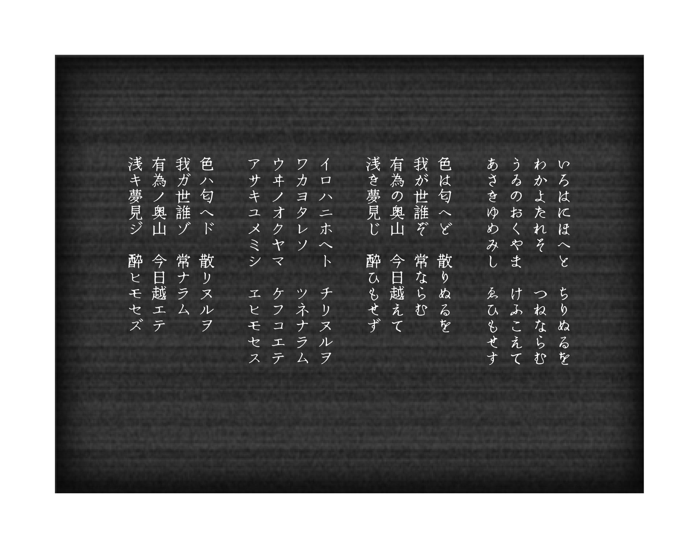

# ニューテゴミン

## フォント概要

2019年にリリースした手書き明朝体フォント「テゴミン」の更新版です。

5mm四方の升目にすべて手書きした明朝体を収録した、手書きのゆらぎ感と明朝体の整然とした佇まいを掛け合わせたフォントを目指しました。

前作「テゴミン」のグリフは記号などを除きほぼ更新しています。

ちょっとだけ優しさがアップしていると思います。

## ライセンス

SIL Open Font License Version 1.1に基づきます。

・商用、個人利用ともに自由に利用、修正ができます。

・派生フォントに関しては同様にSIL Open Font License Version 1.1のライセンスが適用されます。

・フォント単体での販売はできません。

・派生フォントに「ニューテゴミン」の名前を冠することはできません。

詳しくは下記リンクよりライセンス全文がご覧いただけますのでご利用ください。

https://scripts.sil.org/cms/scripts/page.php?item_id=OFL_web

## 収録文字

・ひらがな、カタカナ(全半角)

・英数(Google Latin Plusに基づく)(全半角)

・JIS第一水準漢字、JIS第二水準漢字

・一部記号

## New Tegomin

A Mincho (Japanese Serif) style font from handwritten letterforms on 5mm square grid. Aimed for a cross-over of Mincho's clean & well organized appearance with handwritten letter's organic movement.